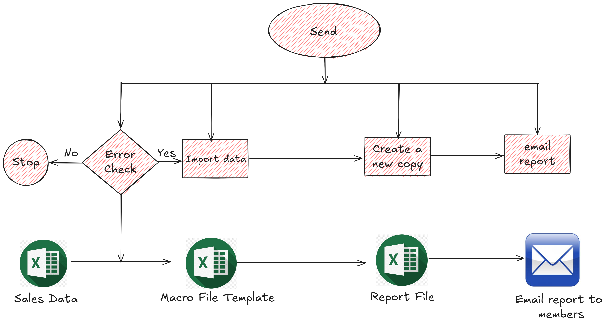

# Sales Reporting Automation

This project automates the process of generating a sales report from an ERP system, saving a copy, and distributing it via email to the team. The following macros are used in this process:

## Project Workflow

1. **Import File**  
   This macro pulls data from an external source file into the existing workbook.
   
2. **Create Report Copy**  
   This macro generates a new report copy without formulas.
   
3. **Send Email**  
   This macro emails the generated report to the team.
   
4. **Error Handling**  
   This macro performs various checks to ensure data integrity and correct file operations.
   
5. **Combine All Macros**  
   This macro combines the above steps into a fully automated workflow.

## Macros

### Macro 1: Import File
- **Objective**: Import sales data from an external file (specified in `Sheet: Console`, Cells `C5` for folder path and `C6` for file name) and copy it into the `Data` sheet (Columns A-E).
- **Key Features**:
  - Existing formulas in Columns F onward are preserved.
  - If the data rows exceed the rows with existing formulas, the formulas will be dragged down to the last row.

### Macro 2: Create Report Copy
- **Objective**: Create a new Excel file containing data from the `Analysis` and `Data` sheets, saving it with the name specified in `Sheet: Console`, Cell `C7`.
- **Key Features**:
  - Formulas linking to other sheets are not copied.
  - Only the relevant data is saved to the new file, removing unnecessary sheets and formulas.

### Macro 3: Send Email
- **Objective**: Send the saved report file via email to recipients listed in the `EmailList` worksheet.

### Macro 4: Error Handling
- **Objective**: Perform validations and checks to ensure the process runs smoothly.
- **Checks Performed**:
  - Column G cannot be blank.
  - Validate that the source file exists.
  - Ensure the report copy file has a `.xlsx` extension.
  - Ensure the source data is not empty.
  - Check for column count mismatches between source data and template.
  - Validate column headers match expected values.

### Macro 5: Combine All Macros
- **Objective**: Combine the above macros into a single macro that automates the entire process.
- **Key Adjustments**: Some macros will be adjusted to ensure smooth end-to-end automation when called in sequence.

## Project Architecture Overview
This project ensures that the monthly sales reporting process is efficient, reliable, and automated. By leveraging these macros, manual intervention is minimized, and errors are reduced. The combined automation steps ensure that data from the ERP system is correctly processed and distributed to the team in a timely manner.

